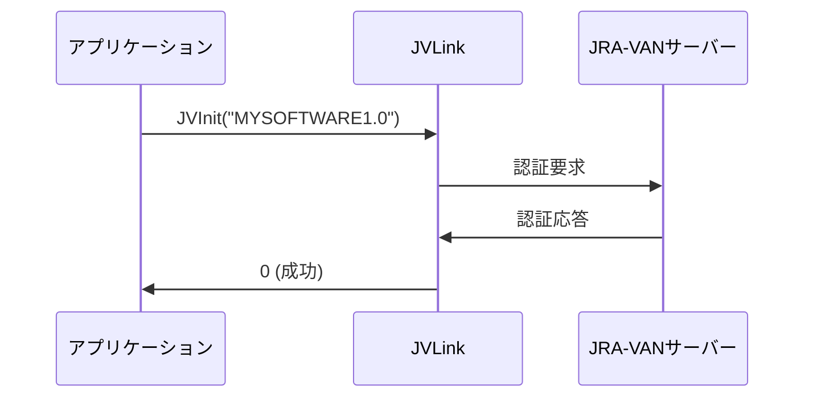
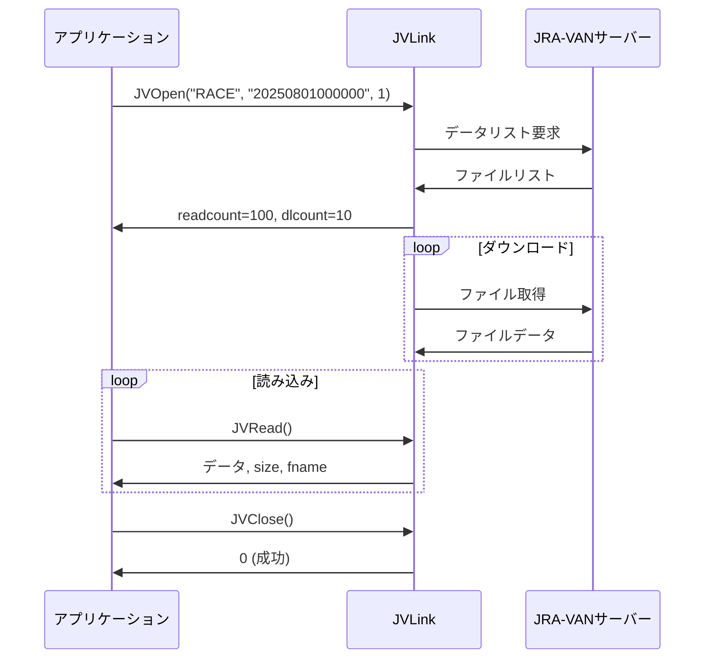

# 通信プロトコル仕様書

## 1. JVLink COM インターフェース

### 1.1 インターフェース概要

| 項目 | 内容 |
|------|------|
| DLL名 | JVDTLAB.dll |
| CLSID | {2AB1774D-0C41-11D7-916F-0003479BEB3F} |
| ProgID | JVDTLab.JVLink |
| アーキテクチャ | 32ビット専用 |
| 登録場所 | C:\Windows\SysWOW64\JVDTLAB\ |

### 1.2 主要メソッド仕様

#### JVInit
```
long JVInit(BSTR sid)
```

| パラメータ | 型 | 説明 | 制約 |
|-----------|-----|------|------|
| sid | BSTR | ソフトウェアID | 最大64文字 |

| 戻り値 | 意味 |
|--------|------|
| 0 | 正常終了 |
| -100 | 内部エラー |
| -102 | SID不正 |

#### JVOpen
```
long JVOpen(BSTR dataspec, BSTR fromtime, long option, 
            long* readcount, long* dlcount, BSTR* lastfiletimestamp)
```

| パラメータ | 型 | 説明 | 制約 |
|-----------|-----|------|------|
| dataspec | BSTR | データ種別 | 4文字固定 |
| fromtime | BSTR | 開始日時 | YYYYMMDDhhmmss |
| option | long | オプション | 1-4 |
| readcount | long* | 読み込み可能件数 | 出力 |
| dlcount | long* | ダウンロード件数 | 出力 |
| lastfiletimestamp | BSTR* | 最終タイムスタンプ | 出力 |

| 戻り値 | 意味 |
|--------|------|
| 0 | 正常（データ無し） |
| 1 | 正常（データ有り） |
| -1 | 重複エラー |
| -201 | JVInit未実行 |
| -202 | 前回JVOpen中 |
| -203 | ダウンロード中 |
| -301 | パラメータ不正 |
| -401 | ファイルがない |
| -411 | サーバーエラー |
| -412 | 通信エラー |
| -421 | 通信初期化エラー |
| -431 | 通信遅延エラー |

#### JVRead
```
long JVRead(BSTR* buff, long* size, BSTR* fname)
```

| パラメータ | 型 | 説明 | 制約 |
|-----------|-----|------|------|
| buff | BSTR* | データバッファ | 出力、最大110KB |
| size | long* | データサイズ | 出力、バイト数 |
| fname | BSTR* | ファイル名 | 出力 |

| 戻り値 | 意味 |
|--------|------|
| 0 | 全データ読み込み完了 |
| 1 | ファイル切り替え |
| -1 | ファイル切り替え（エラー） |
| -3 | ファイルダウンロード中 |
| -201 | JVInit未実行 |
| -202 | JVOpen未実行 |
| -203 | JVOpen実行中 |
| -401 | ファイルがない |
| -402 | ファイル読み込みエラー |
| -403 | ファイルがロックされている |
| -411 | サーバーエラー |
| -412 | HTTPエラー |
| -413 | サーバーメンテナンス中 |
| -421 | 通信初期化エラー |
| -431 | 通信遅延エラー |
| -501 | タイムアウト |

#### JVClose
```
long JVClose()
```

| 戻り値 | 意味 |
|--------|------|
| 0 | 正常終了 |
| -201 | JVInit未実行 |

#### JVStatus
```
long JVStatus()
```

| 戻り値 | 意味 |
|--------|------|
| 0 | アイドル |
| 1 | JVOpen中 |
| 2 | ダウンロード中 |
| -201 | JVInit未実行 |

#### JVCancel
```
long JVCancel()
```

| 戻り値 | 意味 |
|--------|------|
| 0 | 正常終了 |
| -201 | JVInit未実行 |

### 1.3 補助メソッド仕様

#### JVSetUIProperties
```
long JVSetUIProperties()
```
ユーザーインターフェース設定ダイアログを表示

#### JVSetServiceKey
```
long JVSetServiceKey(BSTR servicekey)
```
サービスキーの設定（自動ダウンロード用）

#### JVSetSaveFlag
```
long JVSetSaveFlag(long flag)
```
| flag値 | 動作 |
|--------|------|
| 0 | 保存しない |
| 1 | 保存する（デフォルト） |

#### JVSetSavePath  
```
long JVSetSavePath(BSTR path)
```
データ保存先パスの設定

## 2. 通信シーケンス

### 2.1 初期化シーケンス



### 2.2 データ取得シーケンス



## 3. データ通信仕様

### 3.1 通信プロトコル

| 項目 | 仕様 |
|------|------|
| プロトコル | HTTP/HTTPS |
| ポート | 80/443 |
| タイムアウト | 60秒 |
| リトライ | 3回 |
| エンコーディング | Shift-JIS |

### 3.2 ダウンロードファイル形式

| 項目 | 仕様 |
|------|------|
| ファイル形式 | LZH圧縮 |
| ファイル名 | YYYYMMDD_HHMMSS_dataspec.lzh |
| 最大サイズ | 100MB/ファイル |
| 分割 | 100MB超過時自動分割 |

### 3.3 通信エラー処理

| エラーコード | 内容 | 推奨処理 |
|-------------|------|---------|
| -411 | サーバーエラー | 30分後にリトライ |
| -412 | HTTPエラー | ネットワーク確認 |
| -413 | メンテナンス中 | メンテナンス終了待機 |
| -421 | 通信初期化エラー | プロキシ設定確認 |
| -431 | 通信遅延 | タイムアウト値調整 |

## 4. データフロー制御

### 4.1 フロー制御パラメータ

| パラメータ | デフォルト値 | 最大値 | 説明 |
|-----------|------------|--------|------|
| バッファサイズ | 110KB | 110KB | JVRead単位 |
| 同時接続数 | 1 | 1 | 並列ダウンロード不可 |
| キューサイズ | 100 | 1000 | ダウンロード待機数 |

### 4.2 スループット目安

| 回線速度 | ダウンロード速度 | 1GB取得時間 |
|---------|----------------|------------|
| 100Mbps | 約10MB/s | 約100秒 |
| 10Mbps | 約1MB/s | 約1000秒 |
| 1Mbps | 約100KB/s | 約3時間 |

## 5. セッション管理

### 5.1 セッション仕様

| 項目 | 仕様 |
|------|------|
| セッションタイムアウト | 30分 |
| 同時セッション数 | 1 |
| セッション保持 | クライアント側 |

### 5.2 セッション状態遷移

```
[Idle] --JVInit--> [Initialized]
                        |
                    JVOpen
                        v
                   [Opening]
                        |
                   データ有無
                    /       \
                   有        無
                  /           \
                 v             v
          [Downloading]    [Ready]
                 |             |
            ダウンロード完了    |
                 v             |
            [Reading] <--------+
                 |
             全データ読込
                 |
                 v
            [Complete]
                 |
             JVClose
                 v
           [Initialized]
```

## 6. 認証仕様

### 6.1 認証方式

| 項目 | 仕様 |
|------|------|
| 認証方式 | ソフトウェアID認証 |
| ID形式 | 英数字最大64文字 |
| 有効期限 | なし（永続） |

### 6.2 認証エラー

| エラー | 原因 | 対処 |
|--------|------|------|
| -102 | SID不正 | SID確認 |
| -103 | SID無効化 | JRAへ問い合わせ |

## 7. データ整合性

### 7.1 チェックサム

| 項目 | 仕様 |
|------|------|
| アルゴリズム | CRC32 |
| 対象 | ダウンロードファイル |
| 検証タイミング | ダウンロード完了時 |

### 7.2 データ検証

| レベル | 検証内容 | 処理 |
|--------|---------|------|
| ファイル | CRC32チェック | 再ダウンロード |
| レコード | レコード長検証 | スキップ |
| フィールド | 型検証 | デフォルト値設定 |

## 8. パフォーマンス仕様

### 8.1 レスポンス目標

| 処理 | 目標時間 | 最大時間 |
|------|---------|---------|
| JVInit | 1秒以内 | 5秒 |
| JVOpen | 3秒以内 | 10秒 |
| JVRead | 10ms以内 | 100ms |
| JVClose | 100ms以内 | 1秒 |

### 8.2 メモリ使用量

| 項目 | 使用量 |
|------|--------|
| DLL本体 | 約10MB |
| データバッファ | 110KB/読込 |
| キャッシュ | 最大100MB |
| ワーキングセット | 約50MB |

---

*最終更新: 2025年8月29日*  
*バージョン: 4.9.0.2*